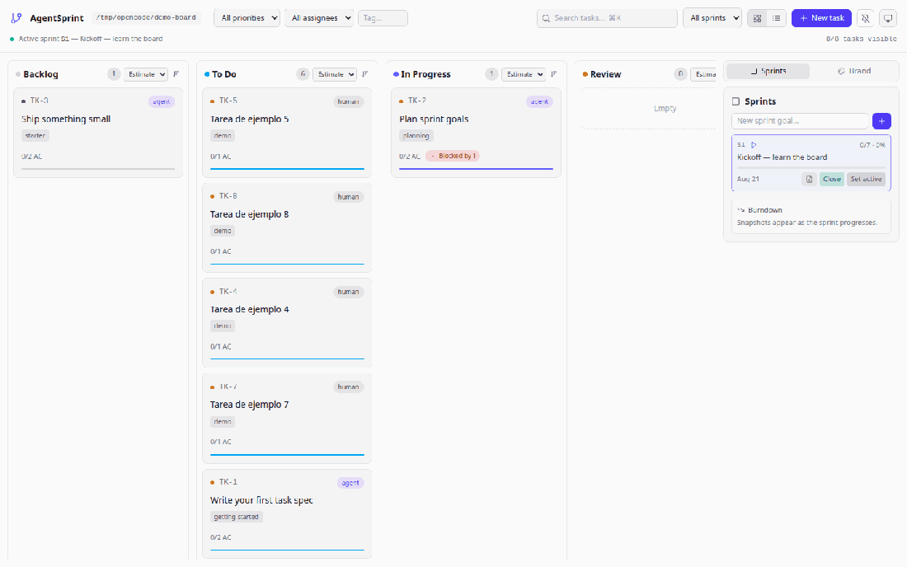

# AgentSprint

> The open-source, git-native Kanban board for AI-assisted development.

AgentSprint gives coding agents a persistent project board inside the repository.
Tasks are Markdown files, state is versioned with Git, and agents can read,
create, update, and organize work through MCP or direct file edits.

[](https://github.com/jmrojas06/AgentSprint/actions/workflows/ci.yml)
[](https://www.npmjs.com/package/@jmrojas06/agentsprint-cli)
[](https://ghcr.io/jmrojas06/agentsprint)
[](https://jmrojas06.github.io/AgentSprint/)
[](LICENSE)

<p align="center">
  <a href="https://jmrojas06.github.io/AgentSprint/">
    
  </a>
</p>

[Documentation](https://jmrojas06.github.io/AgentSprint/) ·
[Issues](https://github.com/jmrojas06/AgentSprint/issues) ·
[Changelog](CHANGELOG.md)

## Why AgentSprint

AI coding agents are good at executing work but forget between sessions. A
chat context dies with the context window; a `TODO.md` carries no state, no
sprints, and no acceptance criteria.

AgentSprint keeps project work where the code lives:

- Tasks live in `.agentboard/` inside your repository — not in someone else's cloud.
- Each task is one Markdown file with YAML frontmatter, readable by humans and agents alike.
- Status changes are plain text edits, so Git history becomes your board history — reviewable in pull requests, diffable, restorable.
- Agents participate through MCP or by editing files directly; you review and decide what is done.

No accounts. No server to maintain. Your board is a folder in Git.

## What AgentSprint gives you

- **Git-native task storage** — one task = one Markdown file under `.agentboard/tasks/`
- **Kanban board** — local web UI with configurable columns, filters, sorting and checklists
- **Sprint management** — plan, activate, close; stats and burndown per sprint
- **Persistent context** — learnings memory and brand kit injected into every task spec an agent receives
- **CLI** — init boards, serve the UI, export specs, lint integrity, import TODOs or GitHub issues
- **MCP server** — stdio and HTTP transports so any MCP-compatible agent can work the board
- **REST API + SSE** — every board operation available programmatically, with live updates
- **File watcher** — edit `.agentboard/` files directly and the UI updates instantly
- **Full-text search** — SQLite-backed index with zero native dependencies
- **Docker** — self-hosted image with health check for always-on setups

## How it works

```text
┌─────────────────────────────────────────────┐
│ Human / AI coding agent                     │
│ Claude · Codex · OpenCode · other MCP apps  │
└──────────────────┬──────────────────────────┘
                   │ MCP or direct file edits
                   ▼
┌─────────────────────────────────────────────┐
│ AgentSprint                                 │
│ CLI · MCP server · Kanban UI · REST API     │
└──────────────────┬──────────────────────────┘
                   │ reads/writes
                   ▼
┌─────────────────────────────────────────────┐
│ .agentboard/                                │
│ Markdown tasks · sprints · project context  │
└─────────────────────────────────────────────┘
```

Because tasks are files inside your repository, they version with your code.
Commit them, branch them, review them in PRs — the board has the same
lifecycle as the project itself.

## Choose your setup

AgentSprint is split into multiple internal packages, but users only need to
choose one entry point: the CLI, MCP server, Docker image, or source
repository.

| Use case | Recommended entry point |
|---|---|
| Run the board quickly | [CLI](#quick-start-with-the-cli) |
| Connect an AI agent | [MCP server](#connect-an-ai-agent-with-mcp) |
| Run with containers | [Docker](#docker) |
| Modify or contribute | [Source repository](#install-from-source) |

You never install the internal packages (`core`, `server`, `web`) manually —
they ship as dependencies of the entry point you pick.

## Quick start with the CLI

Requires Node.js ≥ 20.

```bash
npx @jmrojas06/agentsprint-cli init   # creates .agentboard/ with sample content
npx @jmrojas06/agentsprint-cli serve  # starts the board at http://127.0.0.1:4310
```

What each command does:

- `init` — scaffolds `.agentboard/` (config, sample tasks, sprints, templates)
  plus an `AGENTS.md` that tells any coding agent how to work here.
- `serve` — starts the local server, serves the Kanban UI and REST API, and
  watches board files for changes. If port 4310 is busy it automatically picks
  the next free port.

Prefer a global install so the short `agentboard` binary is on your PATH:

```bash
npm install -g @jmrojas06/agentsprint-cli
agentboard init
agentboard serve
```

Then point your AI coding agent at the repository — it will follow
`AGENTS.md`.

## Connect an AI agent with MCP

Two different roles:

- The **CLI** initializes the board and runs the local UI/server.
- The **MCP server** lets an agent read and modify the board through tools —
  claim tasks, tick acceptance criteria, log notes, manage sprints.

Run the standalone MCP server against your project:

```bash
npx -y @jmrojas06/agentsprint-mcp --root /path/to/your/project
```

It speaks stdio by default; set `AGENTSPRINT_ROOT` instead of `--root` if your
client prefers environment variables.

| Client | Transport | Setup |
|---|---|---|
| Any MCP client | stdio | Point it at `@jmrojas06/agentsprint-mcp` with `--root <dir>` |
| Any MCP client (remote) | Streamable HTTP | Start `serve --mcp`, connect to `http://127.0.0.1:4310/mcp` |
| Claude Code / Codex / others | stdio or HTTP | Follow the client's MCP configuration format using the command above |
| OpenCode | remote HTTP | See [docs/mcp.md](docs/mcp.md) for the `opencode.json` snippet used during development |

Compatibility note: AgentSprint implements the standard Model Context
Protocol, which makes it usable from any MCP-capable client. Individual client
config formats change between versions — if a client doesn't connect, compare
its config against [docs/mcp.md](docs/mcp.md) and the client's current
documentation.

### MCP over HTTP

If you want several tools (UI + agent) sharing one running board, start the
server with `--mcp`:

```bash
agentboard serve --mcp
```

The same process then exposes:

- Kanban UI at `http://127.0.0.1:4310`
- REST API under `http://127.0.0.1:4310/api/*`
- MCP Streamable HTTP at `http://127.0.0.1:4310/mcp`

Use stdio when the agent should own a dedicated short-lived session; use HTTP
when the board is already running and the agent just connects by URL.

## Docker

For an always-on board (e.g. a home server), use the published image:

```bash
docker run -d --name board --restart unless-stopped \
  -p 4310:4310 \
  -v /path/to/your-project:/board \
  ghcr.io/jmrojas06/agentsprint serve /board --host 0.0.0.0 --no-open --init
```

- `/board` is the volume mount: point it at a directory containing one or more
  repositories with `.agentboard/`.
- Port `4310` is fixed inside the container; only remap the host side.
- `--init` auto-creates a board if none exists in the mounted volume — drop it
  once your board is initialized.
- Open `http://localhost:4310` for the UI; add `--mcp` to expose
  `/mcp` for remote agents.

A health check hits `/api/health`. For multi-project self-hosting see
[docker-compose.yml](docker-compose.yml).

## Install from source

This route is for development and contribution, not the quick path for end
users:

```bash
git clone https://github.com/jmrojas06/AgentSprint.git
cd AgentSprint
pnpm install
pnpm build
```

Requires Node.js ≥ 20 and pnpm ≥ 9. Run the locally built CLI with
`pnpm agentsprint <command>`.

## Repository layout

What `agentboard init` creates in your project:

```text
your-project/
├── AGENTS.md                 ← instructions for any AI coding agent
└── .agentboard/
    ├── config.yaml           ← workflow columns & statuses
    ├── brand.md              ← optional brand kit injected into task specs
    ├── tasks/                ← one Markdown file per task (TK-1.md, …)
    ├── sprints/              ← sprint goal + state files
    └── templates/            ← reusable task templates
```

A task file pairs YAML frontmatter (machine state) with a Markdown body
(human + agent context):

```markdown
---
id: TK-1
title: Write your first task spec
status: To Do          # Backlog → To Do → In Progress → Review → Done
assignee: human        # human | agent
---
## Acceptance criteria
- [ ] First criterion
```

Full field reference: [docs/task-format.md](https://jmrojas06.github.io/AgentSprint/task-format).

## Agent workflow

Typical loop with a coding agent:

```text
1. Developer runs agentboard init and plans tasks/sprints.
2. Agent reads AGENTS.md and the active sprint.
3. Agent claims a task — status moves to In Progress.
4. Agent works on the codebase, ticking acceptance criteria.
5. Agent moves the task to Review and logs execution notes.
6. Developer reviews, sets Done; Git records code + board together.
```

Humans own *Done*. Agents stop at *Review* — you verify the criteria before
work ships.

## CLI reference

| Command | Purpose |
|---|---|
| `agentboard init [dir]` | Scaffold `.agentboard/` with sample content |
| `agentboard serve [dir]` | Start the server, UI and REST API (default command) |
| `agentboard spec <dir> <id>` | Print a self-contained agent prompt for a task |
| `agentboard brand [dir]` | Print the project's brand kit |
| `agentboard lint [dir]` | Check board integrity (YAML, IDs, sprints, dependency cycles) |
| `agentboard close [dir] [id]` | Close a sprint and append a retrospective |
| `agentboard task new [title] [dir]` | Create a task, optionally from a template |
| `agentboard import todo <file>` | Import bullets/checkboxes from a TODO-style Markdown file |
| `agentboard import github <owner/repo>` | Import open GitHub issues via the `gh` CLI |
| `agentboard export md` | Write `BOARD.md`, a static Markdown snapshot |

Details and options: [docs/cli.md](https://jmrojas06.github.io/AgentSprint/cli).

## MCP tools

28 tools are exposed over both transports. Highlights:

| Tool | Purpose |
|---|---|
| `board_summary` | Active sprint, counts per status, completion % |
| `task_list` / `task_get` | Browse and read tasks with filters |
| `task_create` / `task_update` / `task_delete` | Manage tasks |
| `task_claim` / `task_release` | Claim work exclusively (lock with TTL) |
| `task_status` | Move a task across the board |
| `task_checklist` | Tick acceptance criteria |
| `task_note` | Append timestamped execution notes |
| `task_spec` | Get the full copy-pasteable prompt for a task |
| `sprint_activate` / `sprint_close` / `sprint_report` | Drive the sprint lifecycle |
| `brand_get` / `learnings_get` | Read injected project context |

Complete reference: [docs/mcp.md](https://jmrojas06.github.io/AgentSprint/mcp).

## Features

Available today:

- [x] Git-native Markdown tasks with YAML frontmatter
- [x] Kanban UI with configurable columns, filters and sorting
- [x] Interactive acceptance-criteria checklists with live sync
- [x] Sprints: plan, activate, close, stats and burndown
- [x] Dependency graph with cycle detection and blocked-task awareness
- [x] Task spec export with brand-kit and learnings injection
- [x] MCP server (stdio + Streamable HTTP)
- [x] REST API + SSE real-time updates + file watcher
- [x] SQLite full-text search with in-memory fallback
- [x] Board linter, TODO/GitHub issue import, static `BOARD.md` export
- [x] Docker image with health check + docker-compose
- [x] Automatic port fallback (`--no-fallback` to disable)

## Roadmap

- [ ] Velocity charts and retrospectives polish
- [ ] Review gates
- [ ] Plugin system for custom task sources
- [ ] Web component library for embedding boards

## Documentation

Full documentation at **https://jmrojas06.github.io/AgentSprint/**

- [Installation](https://jmrojas06.github.io/AgentSprint/installation)
- [Quick start](https://jmrojas06.github.io/AgentSprint/quick-start)
- [Task file format](https://jmrojas06.github.io/AgentSprint/task-format)
- [CLI reference](https://jmrojas06.github.io/AgentSprint/cli)
- [MCP server & tools](https://jmrojas06.github.io/AgentSprint/mcp)
- [REST API](https://jmrojas06.github.io/AgentSprint/api)
- [Architecture](https://jmrojas06.github.io/AgentSprint/architecture)
- [Troubleshooting](https://jmrojas06.github.io/AgentSprint/troubleshooting)

## Contributing

See [CONTRIBUTING.md](CONTRIBUTING.md) for development setup, testing and pull
request guidelines. In short — fork, branch, and validate with:

```bash
pnpm typecheck
pnpm test
pnpm build
```

## License

[MIT](LICENSE)

## Support the project

If AgentSprint is useful to you:

- Star the repository.
- Try it in a real project.
- Open an issue with feedback.
- Share your workflow.
- Contribute documentation or code.
